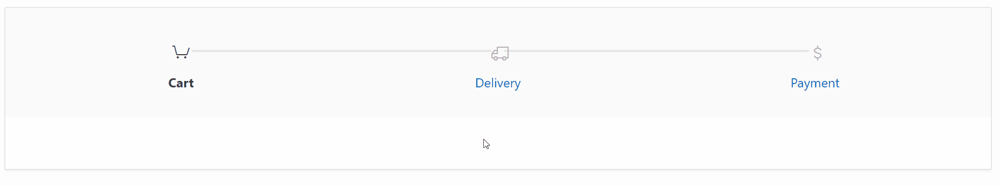

# Oracle APEX Region Plugin - Enchanced Wizard
The plugin add new features to the APEX Wizard region.

## Installation ##
Import *region_type_plugin_rodrigomesquita_wizard.sql* file into your application.

## Pre-Usage ##
1. Create a list on shared components/Lists

## Usage ##
1. Create a region
2. Choose the region type to *Enhanced Wizard[Plug-In]*.
3. Click on the region attributes and type the list name.

## Options ##
1. Show links: Choose yes to use the list entry name as a link
2. Show Custom Icons:  Choose yes to use custom icons by entry. To choose the icon, just edit the list entry and on User Defined Attributes 1, type the font apex icon name. eg. *fa-calendar-edit*

## Preview ##

## Demo ##

https://apex.oracle.com/pls/apex/f?p=86013

